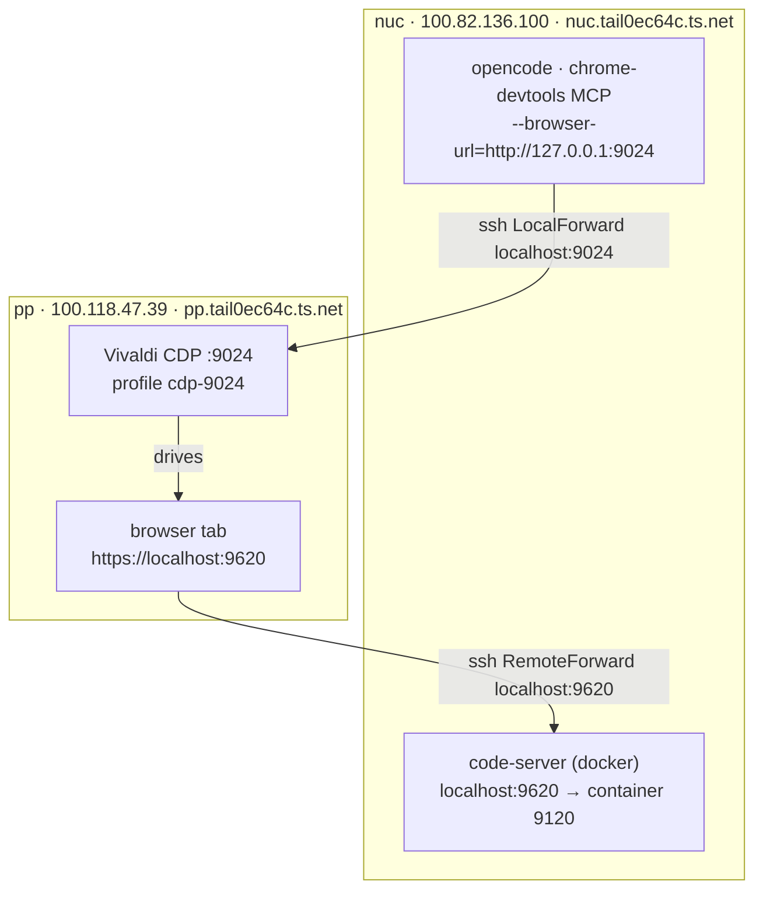

# Dev on nuc, test on pp

Setup for editing code on **nuc** (this machine) via code-server, and testing it in a
real Chromium browser running on **pp**, driven over CDP from opencode's MCP tools.

## Topology



One `ssh pp` session (transport over the tailnet) carries both tunnels:

- `LocalForward localhost:9024` — nuc's localhost:9024 → pp's CDP port
- `RemoteForward localhost:9620` — pp's localhost:9620 → nuc's code-server port

The browser never talks to nuc over Tailscale directly; it just opens
`https://localhost:9620` and the ssh tunnel carries it back to nuc.

| Thing        | Where        | Address                                  |
| ------------ | ------------ | ---------------------------------------- |
| code-server  | nuc, docker  | `https://localhost:9620` on pp, via ssh RemoteForward |
| CDP browser  | pp           | `pp:9024`, forwarded to nuc `localhost:9024` |
| MCP server   | nuc (opencode) | `chrome-devtools-mcp --browser-url=http://127.0.0.1:9024` |

## Connection details

`~/.ssh/config` on nuc (relevant bits):

```sshconfig
Host pp
    # cdp
    LocalForward localhost:9022 localhost:9022
    LocalForward localhost:9023 localhost:9023
    LocalForward localhost:9024 localhost:9024

    # code-server
    RemoteForward localhost:9620 localhost:9620
```

So as long as `ssh pp` is connected, pp's CDP ports are on nuc's localhost, and
code-server is on pp's localhost. Sanity checks:

```bash
ssh pp                                        # establish the forwards
curl -s http://localhost:9024/json/version    # CDP responds with browser version
ssh pp 'curl -sk https://localhost:9620/healthz'  # code-server reachable from pp
```

The browser on pp is launched as:

```bash
/opt/vivaldi/vivaldi-bin \
  --remote-debugging-port=9024 \
  --user-data-dir=$HOME/.local/share/vivaldi-cdp-profiles/cdp-9024 \
  --ignore-certificate-errors \
  --remote-allow-origins='*' \
  --disable-gpu
```

There are sibling profiles for 9022/9023 (`cdp-9022`, `cdp-9023`) if you need more than
one browser at a time.

## code-server

`docker-compose.yml` (repo root) runs `codercom/code-server:4.138.0`:

- `9620:9120` — HTTPS on the host, plain 9120 inside the container
- config mounted from `./dot-config/code-server/config.yaml`
  (contains the login password)
- user data (extensions, settings, logs) mounted from `exp/code-server/.local/share/code-server`
- repo mounted read-only from `${HOME}/git`

Restart after any change (the `hotload` shell function = `kill` + `up -d --no-deps --force-recreate`):

```bash
hotload code-server        # no -f so it doesn't follow logs
docker logs --tail 20 code-server
```

Healthy startup logs look like:

```
Using user-data-dir /home/lamnt45/.local/share/code-server
Using config file /home/lamnt45/.config/code-server/config.yaml
HTTPS server listening on https://0.0.0.0:9120/
  - Using password from /home/lamnt45/.config/code-server/config.yaml
  - Using certificate for HTTPS: /home/lamnt45/.config/code-server/localhost.pem
```

Then open `https://localhost:9620` in the pp browser (log in with the password
from the config file above). The ssh `RemoteForward` carries it back to nuc.

## TLS certificate

Self-signed via mkcert, signed by the local mkcert CA (`~/.local/share/mkcert`, present on
both nuc and pp). The browser connects as `localhost:9620`, so the `localhost`/`127.0.0.1`
SANs are what matter; the `*.ts.net` names are belt-and-braces in case you ever hit nuc
directly over the tailnet. Regenerate when the tailnet name/IP changes:

```bash
CAROOT=$HOME/.local/share/mkcert mkcert \
  -cert-file ./dot-config/code-server/localhost.pem \
  -key-file ./dot-config/code-server/localhost-key.pem \
  "*.tail0ec64c.ts.net" tail0ec64c.ts.net nuc.tail0ec64c.ts.net nuc \
  localhost 127.0.0.1 ::1 100.82.136.100 192.168.1.17

hotload code-server
openssl x509 -in ./dot-config/code-server/localhost.pem -noout -ext subjectAltName
```

Notes:

- X.509 wildcards match one level only: `foo.tail0ec64c.ts.net` works, `a.b.tail0ec64c.ts.net` does not.
- Trust requires the mkcert CA in the client trust store. pp's CDP Vivaldi passes
  `--ignore-certificate-errors`, so it works there regardless.
- A publicly-trusted `*.ts.net` wildcard is not possible (you don't control `ts.net` DNS).
  `tailscale cert nuc.tail0ec64c.ts.net` can issue a real per-node cert (needs HTTPS certs
  enabled in the tailnet), but never a wildcard.

## Recovery runbook (when the workbench looks dead)

Symptom → cause → fix, from a session that hit all of these:

| Symptom | Cause | Fix |
| --- | --- | --- |
| REST `:40620` not listening; pure `custom.eval` works but `executeCommand` / config `update` hang | Workspace is **untrusted** (Restricted Mode) → user extensions not activated | Status bar → **Restricted Mode** → *Trust*, reload. Check `vscode.workspace.isTrusted`. |
| `chromium.connectOverCDP('http://127.0.0.1:9024')` connects the socket then times out | Stray blank / Vivaldi start-page targets stall target attach | Close them: `curl -s http://127.0.0.1:9024/json/close/<targetId>` (from `/json/list`), retry |
| Browser restarted on the code-server **login page** | CDP profile lost its auth cookie | Log in (password in `dot-config/code-server/config.yaml`), by hand or a raw CDP `Runtime.evaluate` form submit |
| A `*`/`onStartupFinished` extension never activates | Not installed for this profile, or trust | Confirm with `code-server --list-extensions --user-data-dir … --extensions-dir …`; check `logs/<ts>/exthost*/remoteexthost.log` |
| A "missing command" error after a container recreate | Fresh host has not activated the extension (`onCommand:` gating) | Invoke the command once to force activation before enumerating commands |
| Settings you didn't change are different | A test mutated them; settings persist | Restore from VS Code **local history** (`…/code-server/User/History/<id>/*.json`) |

Prefer the order: check trust → prune stray CDP targets → reload the tab →
*only then* recreate code-server. Recreating resets trust/layout and costs a
re-login.

## Gotchas

- **`command: |` with `\` line continuations in docker-compose breaks code-server flags.**
  YAML keeps the newlines, compose turns `\`+newline into a literal `\n` in the next argv
  token, so `--config`/`--user-data-dir` are not parsed (they land in positional args).
  Symptom: `Wrote default config file to /home/coder/...`, a random password, `Not serving
  HTTPS`. Fix: use exec-form `command:` list entries (see `docker-compose.yml`).
- **If you bypass the tunnel and hit nuc directly over the tailnet, use the `.ts.net`
  hostname, not the raw tailnet IP.** pp's Vivaldi inherits
  `https_proxy=http://172.16.22.209:8140`; `no_proxy` contains `.ts.net` but not
  `100.82.136.100`, so the IP fails with `ERR_TUNNEL_CONNECTION_FAILED` while the MagicDNS
  name works. The normal `https://localhost:9620` RemoteForward path avoids all of this.
- **`tailscale` on pp is not in the non-interactive PATH.** It comes from linuxbrew and is
  only added by interactive bashrc: `ssh pp 'bash -ic "tailscale status"'`.
- **"Workspace does not exist" dialog** on login: the mounted user-data-dir remembers a
  last-opened folder (e.g. `/home/lamnt45/git/vscode-hacker-meta`) that is not mounted into
  the container. `${HOME}/git` is now mounted (read-only), so the dialog should not appear;
  writes inside code-server's workspace will fail while it stays `ro`.
